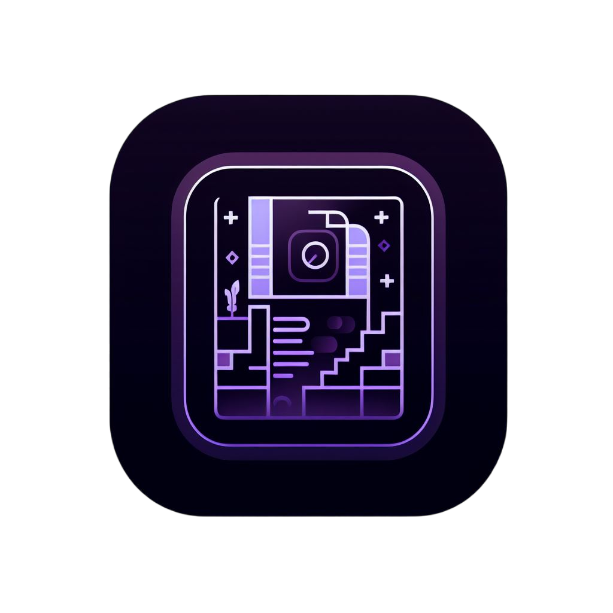

<!-- Improved compatibility of back to top link: See: https://github.com/othneildrew/Best-README-Template/pull/73 -->
<a name="readme-top"></a>
<!--
*** Thanks for checking out the Best-README-Template. If you have a suggestion
*** that would make this better, please fork the repo and create a pull request
*** or simply open an issue with the tag "enhancement".
*** Don't forget to give the project a star!
*** Thanks again! Now go create something AMAZING! :D
-->


<!-- PROJECT SHIELDS -->
<!--
*** I'm using markdown "reference style" links for readability.
*** Reference links are enclosed in brackets [ ] instead of parentheses ( ).
*** See the bottom of this document for the declaration of the reference variables
*** for contributors-url, forks-url, etc. This is an optional, concise syntax you may use.
*** https://www.markdownguide.org/basic-syntax/#reference-style-links
-->
[![LinkedIn][linkedin-shield]][linkedin-url]


<!-- PROJECT LOGO -->
<br />
<div align="center">
  <a href="https://github.com/vivanpoddar/Quairlity">
    
  </a>

  <h3 align="center">Quairlity</h3>

  <p align="center">
    The catch-all AI enabled indoor air quality monitoring solution. Winner of the Congressional App Challenge PA07.
    <br />
    <a href="https://github.com/vivanpoddar/Quairlity">View Demo</a>
    ·
    <a href="https://github.com/vivanpoddar/Quairlity/issues">Report Bug</a>
    ·
    <a href="https://github.com/vivanpoddar/Quairlity/issues">Request Feature</a>
  </p>
</div>


<!-- TABLE OF CONTENTS -->
<details>
  <summary>Table of Contents</summary>
  <ol>
    <li>
      <a href="#about-the-project">About The Project</a>
      <ul>
        <li><a href="#built-with">Built With</a></li>
      </ul>
    </li>
    <li>
      <a href="#getting-started">Getting Started</a>
      <ul>
        <li><a href="#prerequisites">Prerequisites</a></li>
        <li><a href="#installation">Installation</a></li>
      </ul>
    </li>
    <li><a href="#usage">Future Plans</a></li>
    <li><a href="#contact">Contact</a></li>
  </ol>
</details>


<!-- ABOUT THE PROJECT -->
## About The Project

[![Product Name Screen Shot][product-screenshot]](https://github.com/vivanpoddar/Quairlity/blob/main/github_assets/introducing.png)

Note for the Rise submission: This was also my GitHub submission for the Congressional App Challenge, and had its last commit on Nov 1. The reason I submitted this is because it has a stable Android build.

This was my submission for the 2023 Congressional App Challenge, and the video can be found [here](https://www.youtube.com/watch?v=OwDTL8u8CW4&feature=youtu.be). Quairlity offers a holistic solution for indoor air quality monitoring and improvement. It covers a wide range of pollutants and provides actionable insights for users to address these issues effectively. It is an indoor air quality app and inexpensive IoT sensor designed to simplify the process of ensuring a safe and cost-effective indoor air environment. The device is able to detect and identify numerous indoor air pollutants, such as asbestos, mold, CO2, and dust via its Particulate Matter 2.5 sensor, CO2 sensor, temperature and humidity sensor. With the Quairlity AI functionality built on OpenAI's models, by attributing pollutants to specific sources, users can take tailored actions suggested by Quairlity AI to address their unique indoor air quality issues. Through the app's data visualization, users can gain valuable insights into air quality trends, allowing the user to take more informed decisions. The app is the first of its kind in the indoor air quality monitoring space that utilizes AI to offer a two-in-one air quality assistant and monitor, showing its innovation as a product. With its easy to understand UI design for the common person, Quairlity offers a comprehensive indoor air quality monitoring and improvement tool, and is the catch-all solution for any air quality problem. 

<p align="right">(<a href="#readme-top">back to top</a>)</p>


### Built With

These are the main tools I used, though there were many libraries I used such as React Native Paper that are not listed.

* 
* 
* 
* 

Here is an architecture overview for the app:

[![Product Name Screen Shot][product-diagram]](https://github.com/vivanpoddar/Quairlity/blob/main/github_assets/archchart.png)

<p align="right">(<a href="#readme-top">back to top</a>)</p>


<!-- GETTING STARTED -->
## Getting Started

Unfortunately, I wasn't able to procure an iOS build or put the app on the App and Play store because of the $100 cost for an Apple Developer account and $25 for the latter. I did make an Android build and thats the file - ``` application-df72df40-3995-4b16-bf93-af2071e49af2.aab``` (I promise its not a virus)

Here's how you can get install the build on your android device (note that you will not be able to add a valid connection without a sensor):

### Prerequisites
1. Install the homebrew package manager if you don't already have it
```/bin/bash -c "$(curl -fsSL https://raw.githubusercontent.com/Homebrew/install/HEAD/install.sh)"```
2. Install the Android SDK
```brew tap homebrew/cask``` 
```brew install --cask android-sdk```
3. Install the necessary SDK packages:
```android update sdk --no-ui --all```
4. Download bundletool
```brew install bundletool```

### Installation

_Setup the Android build on your device_
1. Download the file ``` application-df72df40-3995-4b16-bf93-af2071e49af2.aab``` from the GitHub repository.
2. Convert the Android App Bundle to an Android package
```bundletool build-apks --bundle=application-df72df40-3995-4b16-bf93-af2071e49af2.aab --output=Quairlity.apks --mode=universal```
3. Download this APK to your device
4. Go to file manager, find the APK file and select it
5. Click install when prompted to do so
6. Done! Quairlity should appear in your app menu

<!-- USAGE EXAMPLES -->
## Future Plans


I will be constantly developing and updating my project, because I want to make this available to many people. Through possibly a crowdfunding operation or grant, I want to install these sensors in buildings for free all throughout my district and particularly in schools, in which this is an increasingly relevant issue. In the production version of the sensor, I will include additionally a TVOC sensor, an ozone sensor, and a carbon monoxide sensor, while keeping costs at a realistic level. Unfortunately, due to time and financial constraints, I wasn't able to purchase and ship these components as I wasn't confident about the shipping time. 

For the app, I plan to utilize machine learning algorithms in object detection to find and discover potential sources of air pollutants through the user taking pictures of the space that they want Quairlity AI to analyze that the client can upload to the app. Some other features I plan to add are integrations with other smart home technologies such as Google Nest which would allow for easier usage with other components of a smart home system. Additionally, a login system that will store your sensor list in place of local storage will be implemented soon.

<p align="right">(<a href="#readme-top">back to top</a>)</p>

<!-- CONTACT -->
## Contact
If you have any suggestions or want to get involved in anything just shoot me an email:

Vivan Poddar - vivanneil@outlook.com

Project Link: [https://github.com/vivanpoddar/Quairlity/](https://github.com/vivanpoddar/Quairlity/)

<p align="right">(<a href="#readme-top">back to top</a>)</p>


<!-- ACKNOWLEDGMENTS -->
## Acknowledgments

Would like to use this space for resources that helped me along this path

* AirGradient for their PCB and STL file.
* Jeff Geerling for his great tutorials and driver code for the sensor.
* My Physics teacher, Dr. Peterson, for helping me learn how to solder.
* Other resources I used
	* React Native Paper
	* Gifted Chat
	* React Native Chart Kit
	* OpenAI API
	* Axios

Just to emphasize, all resources I used were either open-source or with the knowledge of the original developer.

<p align="right">(<a href="#readme-top">back to top</a>)</p>


<!-- MARKDOWN LINKS & IMAGES -->
<!-- https://www.markdownguide.org/basic-syntax/#reference-style-links -->
[contributors-shield]: https://img.shields.io/github/contributors/othneildrew/Best-README-Template.svg?style=for-the-badge
[contributors-url]: https://github.com/vivanpoddar/Quairlity/graphs/contributors
[forks-shield]: https://img.shields.io/github/forks/othneildrew/Best-README-Template.svg?style=for-the-badge
[forks-url]: https://github.com/vivanpoddar/Quairlity/network/members
[stars-shield]: https://img.shields.io/github/stars/othneildrew/Best-README-Template.svg?style=for-the-badge
[stars-url]:https://github.com/vivanpoddar/Quairlity/stargazers
[issues-shield]: https://img.shields.io/github/issues/othneildrew/Best-README-Template.svg?style=for-the-badge
[issues-url]: https://github.com/vivanpoddar/Quairlity/issues
[linkedin-shield]: https://img.shields.io/badge/-LinkedIn-black.svg?style=for-the-badge&logo=linkedin&colorB=555
[linkedin-url]: https://linkedin.com/in/vivanpoddar
[product-screenshot]: https://github.com/vivanpoddar/Quairlity/blob/main/github_assets/introducing.png
[product-diagram]: https://github.com/vivanpoddar/Quairlity/blob/main/github_assets/archchart.png

